# Q-SENTINEL: Executive Presentation Deck (SIH-26141)
## Visual Architecture, System Workflow & Prototype Telemetry Pitch Deck

> **Quick Presentation Access**:
> - **Option 1 (Instant High-Def Browser Slide Deck)**: Open [`docs/presentation_deck_v2.html`](file:///c:/Users/Rakshit%20Jain/Downloads/sih/docs/presentation_deck_v2.html) in any browser (Chrome, Edge, Safari). It renders both Slide 1 and Slide 2 in 16:9 widescreen format with high-contrast infographics, Bloch sphere visual icons, attack cards, vertical workflow, and embedded prototype graphs. You can press `Ctrl + P` to print to PDF or take full-resolution screenshots directly into PowerPoint.
> - **Option 2 (AI Slide Generators)**: Copy the Master Prompt in **Section 1** below and paste it into **ChatGPT Plus (Canvas/GPT-4o)**, **Claude 3.5 Sonnet (Artifacts/HTML)**, or **Gamma.app**.
> - **Option 3 (Mermaid Flowchart Export)**: Copy the Mermaid diagrams in **Section 3** for vector imports into Visio, Draw.io, or PowerPoint.

---

# SECTION 1: MASTER COPY-PASTE PROMPT FOR AI SLIDE GENERATION (ChatGPT / Claude / Gamma)

*Copy the entire block below and paste it directly into ChatGPT Plus, Claude 3.5 Sonnet, or Gamma.app:*

```markdown
Generate a 2-slide, high-impact, infographic-driven executive presentation for the Smart India Hackathon 2026 (SIH-26141: National Quantum Mission Track).

Project Title: Q-SENTINEL: Quantum-Inspired Cyber Threat Detection Framework

IMPORTANT DESIGN & LAYOUT DIRECTIVES:
1. DO NOT GENERATE TEXT-HEAVY BULLET POINTS. Make both slides highly visual, modular, and pictorial—using bordered cards, distinct color tints, mathematical callout boxes, process flowcharts, status pills, and visual comparison charts (mimicking executive defense presentation standards).
2. Aspect Ratio: 16:9 widescreen format with clean corporate typography, subtle drop shadows, and high contrast.
3. Include explicit visual containers for 3 real-world working prototype telemetry graphs/screenshots.
4. Emphasize Core Invariant: Zero Machine Learning Hallucinations (100% deterministic physics & sequential statistics), Zero Blockchain Overhead, and 100% Classical CPU Execution (No Cryogenic QPU required).

================================================================================
SLIDE 1: SYSTEM WORKFLOW & ARCHITECTURAL THREAT DETECTION ENGINE
================================================================================
- Slide Header:
  * Top Left: Logo Badge "[QUANT]"
  * Center: Main Title: "Q-SENTINEL: Quantum-Inspired Cyber Threat Detection Framework"
  * Subtitle: "High-Fidelity Quantum Digital Signature (QDS) Teleportation & Statistical Threat Surveillance"
  * Top Right: "SMART INDIA HACKATHON 2026" Badge + Live Network Status "[● Port 8000 ⇄ 8001 ⇄ 8002]"

- Top Section (Split 60% Left / 40% Right):

  [LEFT 60%] SECTION: "Quantum Digital Signature Simulation Pipeline"
  Structure as 3 connected horizontal process cards with directional arrows (➔):
  1. "1. Message & State Preparation":
     - Signer: Alice (Authorized Node)
     - Payload: SHA-256 Digest of Transaction (e.g. Wire Transfer $500,000)
     - State Encoding: Non-orthogonal Pauli eigenstates across 3 mutually unbiased bases:
       * Z-basis: {|0⟩, |1⟩} (Blue Bloch sphere icon)
       * X-basis: {|+⟩, |-⟩} (Green Bloch sphere icon)
       * Y-basis: {|+i⟩, |-i⟩} (Pink Bloch sphere icon)
  2. "2. Bell State Generation":
     - Entanglement Resource: Maximally entangled EPR singlet pair: |Φ⁺⟩ = (|00⟩ + |11⟩)/√2
     - Visual: Two interconnected purple spheres (Qubit A shared with Alice, Qubit B shared with Bob).
  3. "3. Teleportation & Sink":
     - Joint 3-Qubit Bell State Measurement (BSM) by Alice.
     - Dispatches 2 classical feed-forward bits (m₁, m₂) over public IP network.
     - Receiver (Bob) applies unitary Pauli correction: U = Z^{m₁} · X^{m₂} to reconstruct |ψ⟩.
     - Flow Banner: "Bell Measurement + Classical Feed-Forward Bits (m₁, m₂) + Unitary Pauli Correction = Quantum Teleportation".

  [RIGHT 40%] SECTION: "Adversarial Threat Interception (Eve Relay Node on Port 8001)"
  Structure as a 2x2 grid of 4 colorful threat alert cards:
  1. Forgery Card (Crimson Tint):
     - Icon: Hacker Mask / Altered State
     - Threat: Eve injects arbitrary random states without secret key (~50% error rate).
     - Alert Badge: [🚨 Detected as FORGERY (SPRT LLR ≥ +9.21)]
  2. Impersonation Card (Orange Tint):
     - Icon: Impostor ID Badge / Basis Collapse
     - Threat: Unauthorized signer (Mallory) claims identity; distribution basis collapses.
     - Alert Badge: [🚨 Signer Quarantined & Blocked]
  3. Replay Attack Card (Blue Tint):
     - Icon: Database Replay / Refresh Arrow
     - Threat: Re-transmitting recorded quantum tokens past freshness TTL (>60s) or Bob-Charlie desync.
     - Alert Badge: [🚨 Stale Nonce Invalidated]
  4. Optical Channel & Side-Channels (Purple Tint):
     - Icon: Laser Pulse / Frequency Waveform / Tap
     - Threat: Photon number splitting (PNS) & Trojan-horse spy lasers (>0.01 µW probe power).
     - Alert Badge: [🚨 Optical Watchtower Tripped]

- Bottom Section: "Statistical Threat Detection Engine (Sequential Q-STAT Surveillance)"
  Structure as 5 horizontal connected pipeline cards:
  1. "1. Baseline Distribution":
     - Optical fiber baseline noise floor: p₀ = 2.87% (Loss & dark counts).
     - Mini bar chart: Expected theoretical fidelity vs. observed baseline.
  2. "2. Sequential Likelihood Distance":
     - Mathematical metric: Wald Likelihood Ratio Λ_n = ∏ P(x_i|H₁) / P(x_i|H₀) and Page's CUSUM S_n = max(0, S_{n-1} + z_i - k).
     - Detects persistent shifts AND intermittent micro-burst tampering.
  3. "3. Threshold Decision Matrix":
     - Clean 3-row mini table:
       * Legitimate: SPRT LLR ≤ -9.21 / CUSUM < 8.5 ➔ [ACCEPT (Green)]
       * Suspicious Drift: 2.0σ ≤ z < 4.0σ ➔ [FLAG FOR AUDIT (Orange)]
       * Malicious Attack: SPRT LLR ≥ +9.21 / CUSUM > 8.5 ➔ [REJECT & CUT LINK (Red)]
  4. "4. Security Confidence Gauge":
     - Semi-circular speedometer gauge pointing to 99.99% Confidence (Joint α = 1e-4).
     - Stat Badge: "Sub-Second Early Stopping: 98.5% Quantum Bandwidth Saved".
  5. "5. Output Verification & Cryptographic Ledger":
     - Green Badge: "[✓ LEGITIMATE SIGNATURE ACCEPTED]"
     - Metrics: Anomaly z = -0.44σ | Latency = 5.60 ms | Nonce = Valid
     - Tamper-evident SHA3-256 hash pointer minted.

- Slide Footer:
  * Left: Badges: "[✓ 100% Deterministic Physics]" | "[✓ Zero Black-Box AI Hallucinations]" | "[✓ Zero Blockchain Overhead]"
  * Right: "SIH-26141 | National Quantum Mission Track | Slide 1 of 2"

================================================================================
SLIDE 2: COMPLETE TECHNOLOGY STACK, WORKFLOW & LIVE PROTOTYPE TELEMETRY
================================================================================
- Slide Header:
  * Top Left: Logo Badge "[QUANT]"
  * Center: Main Title: "TECHNICAL APPROACH & LIVE PROTOTYPE TELEMETRY"
  * Subtitle: "Complete Engineering Tech Stack, End-to-End Workflow, and Empirical Quantum Telemetry"
  * Top Right: Status Badge "[● 130/130 Tests Passing (100% Green)]" + "SIH 2026"

- 3-Column Layout:

  [COLUMN 1: 25% Width] "Technologies Used & Hardware Footprint"
  Stack of 6 modern rounded tech cards + 1 hardware requirement callout:
  1. Python 3.14 (Programming): Core algorithmic simulation, socket orchestrator, zero external compiler dependencies.
  2. NumPy 2.x (Quantum Simulation): High-performance matrix-vector operations, Pauli tensor products, density states.
  3. SciPy 1.15 (Statistical Analysis): Exact binomial hypothesis testing, Beta-Binomial conjugate posteriors, KL-divergence.
  4. Streamlit & Plotly (UI & Visualization): Institutional SOC dashboard, interactive Bloch spheres, real-time telemetry streaming.
  5. Decoupled Microservices (Networking): Standalone HTTP REST services on ports 8000 (Alice), 8001 (Eve), and 8002 (Bob) with strict AST import isolation.
  6. FIPS Cryptography (Security & Audit): NIST FIPS 202 SHA3-256 tamper-evident chaining + OASIS STIX 2.1 JSON threat intelligence export.
  * Bottom Banner: "⚡ Hardware Requirement: Runs entirely on standard classical CPU hardware without requiring physical quantum processors (QPU). [✓ 100% Classical Commodity Execution]"

  [COLUMN 2: 25% Width] "System Workflow (End-to-End Execution Flowchart)"
  Vertical connected flowchart with distinct high-contrast boxes and downward arrows (▼):
  1. [User Input: Transaction Payload (e.g. Wire Transfer $500,000)]
  2. [Alice Signer Node: SHA-256 Digest → Non-Orthogonal Pauli State Key Prep]
  3. [Entangled Bell-State Generator: (|00⟩ + |11⟩)/√2 Entanglement Resource]
  4. [Teleportation Engine: Bell State Measurement (BSM) & Classical Bits (m₁, m₂)]
  5. ➔ [🔴 ATTACK INJECTION POINT: Eve Relay on Port 8001 (Noise / Forgery / Impersonation)] ➔
  6. [Bob Verifier Sink on Port 8002: Unitary Pauli Correction U = Z^{m₁} · X^{m₂}]
  7. [Dual-Layer Surveillance: 14 Optical Watchtowers + Sequential Q-STAT Engine]
  8. [Threat Classifier: LEGITIMATE (Pass) / SUSPICIOUS (Flag) / MALICIOUS (Quarantine)]
  9. [Final Output: Multi-Party Non-Repudiation Certificate & SHA3-256 Tamper-Evident Ledger]

  [COLUMN 3: 50% Width] "Live Working Prototype Telemetry (Empirical Validation)"
  Dedicated container showcasing 3 actual prototype graphical panels:
  
  Panel A: "Projective Measurement Statistics & Empirical Born Rule Validation"
  - Key Parameters: Prepared Eigenstate |-⟩ | Measurement Basis: X | Observed Error Rate: 2.0% (50 Shots).
  - Visual Bar Chart: Theoretical Born Rule (97.3%) vs. Observed Empirical Outcomes (98.0%) with near-zero deviation count (2.0%).
  - Callout: "Empirical physical proof: Measured error rate matches theoretical channel noise (-0.7% vs baseline)."
  
  Panel B: "Real-Time Telemetry Anomaly Trend (Z-Score Trajectory Stream)"
  - Visual Line Graph: Past 30 verification events tracking Standardized Z-Score (σ).
  - Clean baseline runs remain completely flat at ~0σ to 0.5σ (below Suspicious Threshold z = 2.0σ).
  - Attack runs (Runs 393–395) explosively spike past +75σ to +92.4σ!
  - Red dashed threshold line at Critical Threat (z ≥ 4.0σ).
  - Callout: "💥 Immediate Attack Detection: Forgery triggers instantaneous +92.4σ anomaly spike."
  
  Panel C: "Multi-Party Non-Repudiation & Cryptographic Audit Certificate"
  - Left mini-table: Bob Verdict = LEGITIMATE (e=3.2%) | Charlie Verdict = LEGITIMATE (e=2.5%) | Discrepancy Rate = 0.0% | Status = [PASSED (TRANSFERABLE)].
  - Right monospace immutable audit certificate block:
    "Ref: QDS-CERT-8A6130EDC538 | Signer: Alice | Payload: Wire Transfer $500,000 | Latency: 5.60ms | Disposition: AUTHENTIC AND ACCEPTED | SHA3-256 Ledger Chained".

- Slide Footer:
  * Left: Badges: "[✓ Early Stopping at Trial 6]" | "[✓ 98.5% Quantum Bandwidth Saved]" | "[✓ OASIS STIX 2.1 Export Ready]"
  * Right: "SIH-26141 | National Quantum Mission Track | Slide 2 of 2"
```

---

# SECTION 2: SLIDE-BY-SLIDE VISUAL MAPPING (HOW THE 5 IMAGES ARE INTEGRATED)

| Component in New Deck | Source Image from Prototype / Previous Deck | How It Is Represented in the New Visual Layout |
| :--- | :--- | :--- |
| **QDS Simulation & Bloch Spheres** | **Image 1 (Previous PPT - Top Left)** | 3 connected boxes showing Alice eigenstate prep with 3 mini Bloch spheres ($|0\rangle, |+\rangle, |+i\rangle$), Bell state generator $(|00\rangle+|11\rangle)/\sqrt{2}$, and teleportation engine with Pauli correction ($U = Z^{m_1} X^{m_2}$). |
| **Adversarial Attack Cards** | **Image 1 (Previous PPT - Top Right)** | 4 distinct colored cards: Forgery (crimson), Impersonation (orange), Replay (blue), Optical Channel (purple) with alert badges and early stopping stats. |
| **Statistical Threat Engine** | **Image 1 (Previous PPT - Bottom)** | 5-step horizontal pipeline: Baseline distribution bar chart $\to$ Sequential Likelihood formula $\to$ Threshold table $\to$ 99.99% Confidence Gauge $\to$ Output verification card. |
| **Tech Stack Cards & CPU Banner** | **Image 2 (Previous PPT - Left)** | 6 modular technology cards (Python, NumPy, SciPy, Streamlit/Plotly, Microservices, Cryptography) + Green banner highlighting **No Quantum Hardware Required (100% Classical Commodity Execution)**. |
| **Vertical Workflow Flowchart** | **Image 2 (Previous PPT - Right)** | Vertical execution flowchart from User Transaction Payload down to Certificate, with a prominent red dashed **ATTACK INJECTION POINT (Eve :8001)**. |
| **Born Rule Empirical Bar Chart** | **Image 5 (Prototype Screenshot 3)** | Embedded inside Slide 2 Column 3 (Panel A): Shows Token #0 ($|-\rangle$ in basis $X$), 50 shots, and the exact bar chart comparing Theoretical Born Rule ($97.3\%$) vs. Observed Empirical Outcomes ($98.0\%$). |
| **Longitudinal Z-Score Spike Graph** | **Image 3 (Prototype Screenshot 1)** | Embedded inside Slide 2 Column 3 (Panel B): Historical 30-run time series graph showing clean runs flat at $0\sigma$ and active forgery runs spiking to $+75\sigma \to +92.4\sigma$ across the $z \ge 4.0\sigma$ threshold. |
| **Multi-Party Non-Repudiation Certificate** | **Image 4 (Prototype Screenshot 2)** | Embedded inside Slide 2 Column 3 (Panel C): Displays the multi-recipient verification table (Bob vs. Charlie $0.0\%$ discrepancy) and the official monospace cryptographic audit certificate (`QDS-CERT-8A6130EDC538`). |

---

# SECTION 3: MERMAID VECTOR ARCHITECTURE FOR SLIDE 1 & SLIDE 2

You can paste this diagram into [mermaid.live](https://mermaid.live) to download high-resolution SVG/PNG assets:

```mermaid
flowchart LR
    subgraph S1 ["1. PHYSICAL SIGNER (Alice)"]
        direction TB
        M["Transaction Payload ($500,000)"] --> D["SHA-256 Digest"]
        D --> P["Pauli State Encoding<br/>{|0⟩, |1⟩, |+⟩, |-⟩, |+i⟩, |-i⟩}"]
        P --> BSM["3-Qubit Joint Bell Measurement"]
        BSM --> CB["Classical Bits (m1, m2) + Token Stream"]
    end

    subgraph S2 ["2. ADVERSARIAL RELAY (Eve :8001)"]
        direction TB
        CB --> EVE{"Channel Interception Point"}
        EVE -->|"Clean Link"| N0["Fiber Noise Floor (p0 ≈ 2.87%)"]
        EVE -->|"Active Forgery"| N1["State Tampering (~50% Error)"]
        EVE -->|"Impersonation"| N2["Mallory Hijack (Basis Mismatch)"]
        EVE -->|"Replay Exploit"| N3["Stale Nonce (>60s Window)"]
        EVE -->|"Optical Tap"| N4["Trojan Laser (>0.01 µW)"]
    end

    subgraph S3 ["3. VERIFIER SINK (Bob :8002)"]
        direction TB
        N0 & N1 & N2 & N3 & N4 --> PC["Unitary Pauli Correction<br/>U = Z^m1 · X^m2"]
        PC --> WT["14 Optical Hardware Watchtowers<br/>(APD Current, Trojan, CHSH S>2, Decoys)"]
        WT --> SQ["Sequential Q-STAT Engine<br/>Page CUSUM (h=8.5) & Wald SPRT (A=+9.21)"]
    end

    subgraph S4 ["4. DECISION & CERTIFICATION"]
        direction TB
        SQ --> DEC{"Sequential Early Stop"}
        DEC -->|"SPRT ≤ -9.21"| OK["LEGITIMATE (Passed)<br/>Mint Non-Repudiation Cert"]
        DEC -->|"SPRT ≥ +9.21"| BLK["MALICIOUS (Halt at Trial 6)<br/>Save 98.5% Bandwidth<br/>Quarantine Mallory"]
        OK & BLK --> CH["SHA3-256 Tamper-Evident Ledger + STIX 2.1"]
    end

    style S1 fill:#f8fafc,stroke:#0f172a,stroke-width:2px
    style S2 fill:#fff1f2,stroke:#be123c,stroke-width:2px
    style S3 fill:#f0fdf4,stroke:#15803d,stroke-width:2px
    style S4 fill:#eff6ff,stroke:#1d4ed8,stroke-width:2px
    style OK fill:#dcfce7,stroke:#16a34a,stroke-width:2px
    style BLK fill:#fee2e2,stroke:#dc2626,stroke-width:2px
```



---

# SECTION 4: HOW TO USE WITH POWERPOINT & GAMMA

1. **For Gamma.app**:
   - Go to [Gamma.app](https://gamma.app) $\to$ Create New $\to$ Paste in text.
   - Paste the block from **Section 1**.
   - Select **Widescreen (16:9)** and choose a clean dark/light card theme. Gamma will automatically generate modular cards and diagrams.
2. **For Claude 3.5 Sonnet / ChatGPT Canvas**:
   - Paste the prompt from **Section 1**.
   - Claude will generate an interactive React/HTML component or exact vector SVG slides that you can download and insert into PowerPoint.
3. **For Direct Screenshot / Instant PPT**:
   - Open [`docs/presentation_deck_v2.html`](file:///c:/Users/Rakshit%20Jain/Downloads/sih/docs/presentation_deck_v2.html) in your browser.
   - Both slides are already rendered in high-definition widescreen with exact CSS styles matching your images.
   - Use Windows Snipping Tool (`Win + Shift + S`) or browser print to capture pixel-perfect slides directly into PowerPoint.
